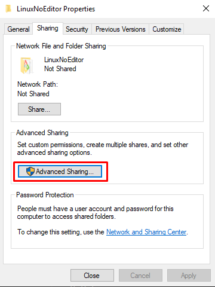
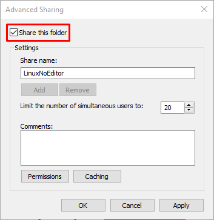
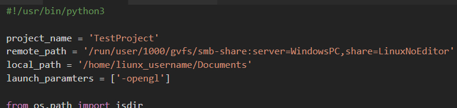

# rup
Workaround tool for automatic deploying Unreal engine projects to linux machines\
The tool is addressing this issue: https://answers.unrealengine.com/questions/899311/ \
It automaticaly detects new project builds, downloads and runs them

# Requirements:
* Python 3

# Setup:
0. Download the [rup.py](rup.py) file to any convenient place on your linux machine
1. Package you game in Unreal editor by going to `File` -> `Package Project` -> `Linux`
2. Share the folder your project is packaged to\
 
3. Mount this folder on a linux machine through smb (I use Nautilus)\
Go to `Other Locations` -> `Connect to Server` and type in `smb://windows_computer_name/shared_folder_name/` -> click `Connect`
4. Right click on empty space in opened folder and click `Open in Terminal`
5. Type `pwd` and copy its output (It will be the same every time you mount this folder, so you have to do it just once)
6. Open rup.py with the text editor
7. Paste what you've copied in step 5 after `remote_path` between two `'` symbols
8. Type the name of your project after `project_name` between two `'` symbols
9. Type the full path to directory where you want the local copy of you project to live after `local_path` between two `'` symbols
10. Place any launch parameters for your game after the `launch_paramters` in between `[` and `]` symbols. Place each parameter it it's own pair of `'` symbols. Seperate the, using commas.

Correctly configred file looks something like this:

# Using rup:
1. Open the dicrectory you downloaded rup.py into in the terminal
2. Type `./rup.py`
2. If `permission denied` error pops up type `chmod +x ./rup.py` and try again
